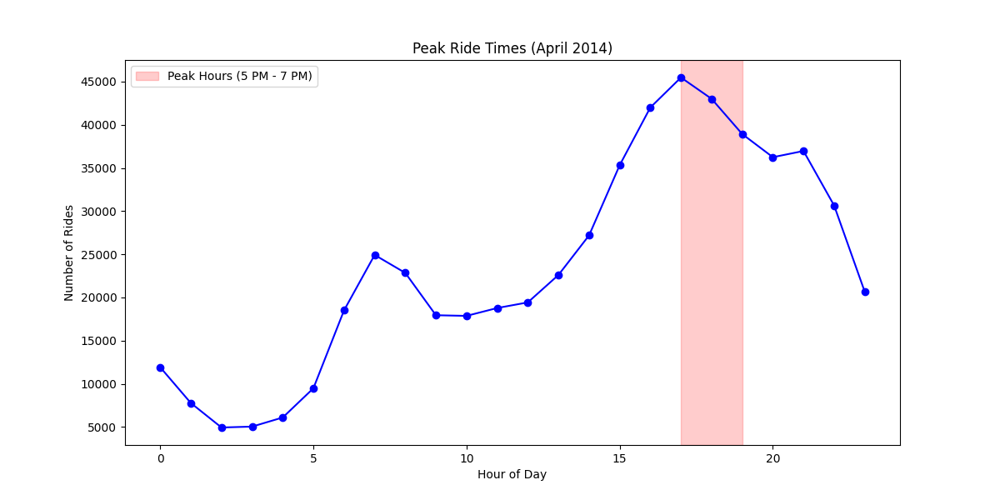
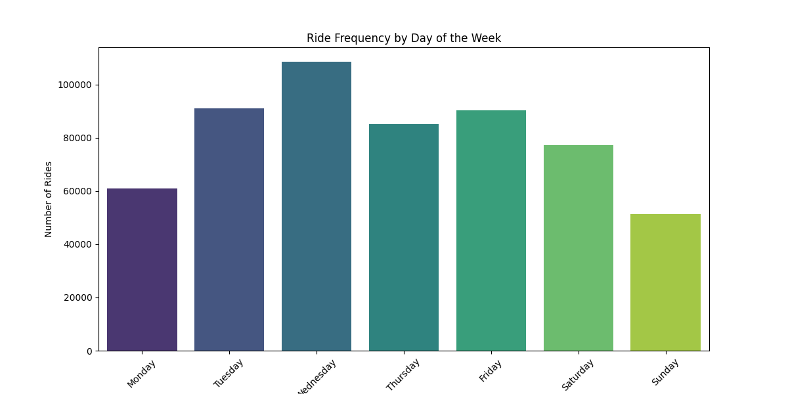

---

### ** Uber Rides Data Analysis**  
*(Python + Pandas + Matplotlib)*  


Analysis of 2014 Uber trip data to identify usage patterns and geographic hotspots.

## Project Goal  
Analyzed **500K+ Uber rides** in NYC (April 2014) to identify trends in peak hours, geographic hotspots, and weekday/weekend demand.

## Key Insights  
- **Peak Hours**: 5 PM - 7 PM daily  
- **Geographic Hotspots**: Manhattan dominance  

## Tools Used  
- **Pandas**: Data preprocessing  
- **Matplotlib/Seaborn**: Visualization  
- **Dataset**: Uber NYC pickup data (April 2014) (Kaggle)

## How to Run  
1. Install dependencies:  
   ```bash  
   pip install pandas numpy matplotlib  


  

